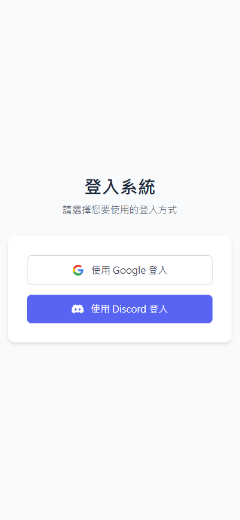
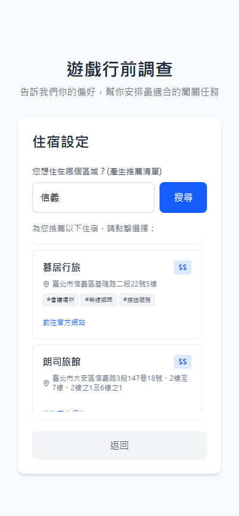
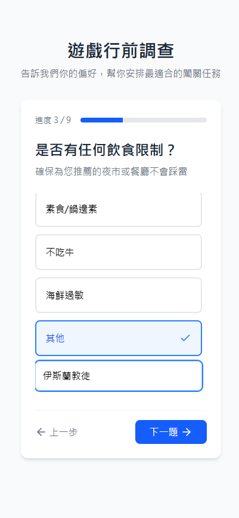
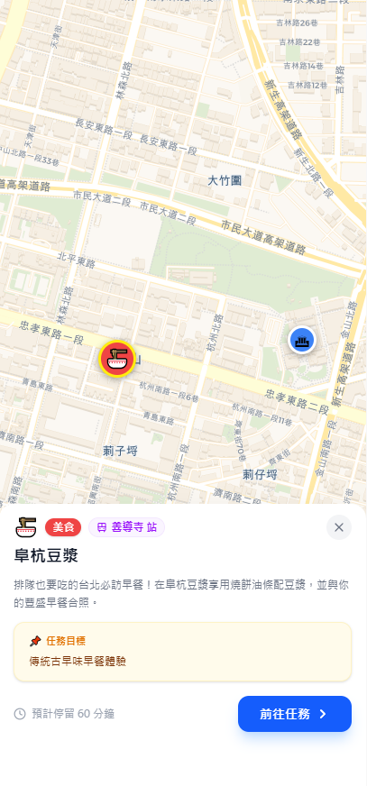
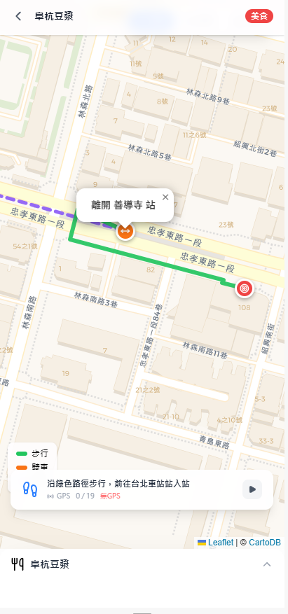
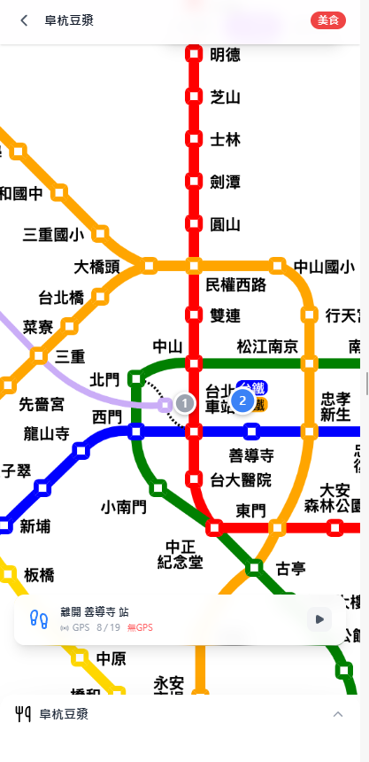
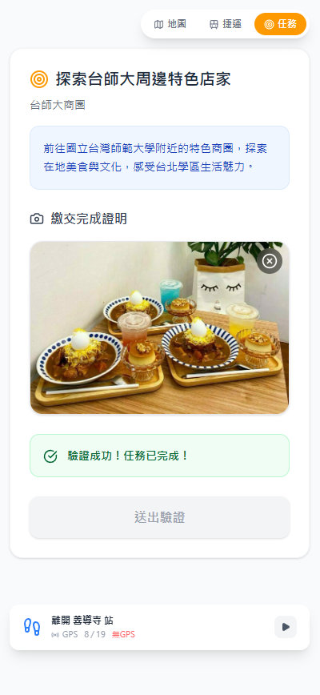
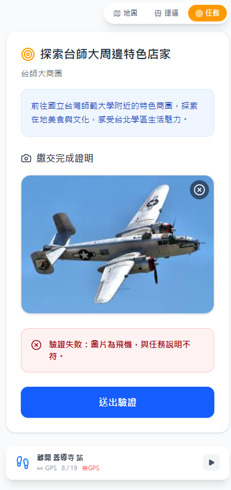

# 冒險台北 Taipei Adventure
## 一個動態生成景點挑戰的智慧觀光旅遊APP
本專案是一個結合前端、後端、行動裝置與地圖導覽的智慧旅遊平台，
協助使用者規劃**台北捷運**沿線的**旅遊行程**，並提供**即時導航**、**任務挑戰**與安全、合法的**住宿**推薦等功能。

## 專案預覽

| 登入介面 | 行前調查 |
| ---- | ---- |
|    |        |
| 行前調查 | 導航頁面 |
|      |      |
| 導航頁面 | 導航頁面 |
|       |      |
| 任務繳交 - 成功 | 導航頁面 |
|       |      |

## 主要功能與優勢
- **DC x Google** 雙登入系統：簡化帳密需求，**快捷登入**

- **智慧旅遊規劃**：依據使用者需求，**客製化推薦**捷運沿線景點與**住宿**，打造專屬行程。

- **雙系統導航**：結合**互動地圖**、**GPS** 與**捷運站內的藍牙 Beacon 訊號**，解決地下站體迷路的問題，室內外導航不中斷。

- **多交通方式導航**：智能算法動態生成

- **安全住宿推薦**：自動對接 [**台北市旅宿網站**](https://www.taiwanstay.net.tw/TSA/web_page/TSA010100.jsp) ，過濾非法日租套房，保障出遊安全。

- **互動式任務挑戰**：抵達指定地點觸發任務與地標打卡，將旅遊化為有趣的**闖關體驗**。

- **極速流暢與高穩定性**：採用 **React** 與 **FastAPI** 現代化架構確保操作滑順，並透過 **Docker** 容器化技術確保多人連線時系統依然穩定運作。

## 技術架構
### 前端（Frontend）

使用 **React** + **TypeScript** 開發，搭配 **Vite** 作為建構工具
地圖與路線規劃功能
與後端 API 串接，實現即時互動

#### GPS
利用 **GPS** 與捷運**藍芽**資訊雙系統輔助定位，保證在捷運也不影響定位

### 後端（Backend）

使用 **FastAPI**（Python）實作 RESTful API
**PostgreSQL** 作為資料庫，Alembic 管理資料庫遷移
提供用戶、任務、旅遊計畫等資料管理

### 行動裝置/藍牙（**beaon2**）

**React Native** 應用，支援藍牙 Beacon 掃描
與後端同步任務進度

### 基礎設施

**Docker** 容器化部署，docker-compose 管理多服務協作
**Nginx** 作為反向代理伺服器

